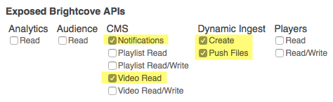

# PHP Wrapper for Brightcove Dynamic Ingest

## About

This project provides a starting point for integrating the Brightcove Dynamic Ingest API into your application. It provides simple ways to add and update videos and associated media using either pull-based ingest or source file upload.

## Requirements

PHP version 5.2 or greater.

## Installation

1. Download, clone, or fork this repository.
2. Copy the **dist** folder to your local or remote web server - *note: for the wrapper to function properly, you must make a physical copy, not a symlink*

___

## Examples

### Instantiation

This example shows how to instantiate, or start, the BCDIAPI PHP class. The argument, a JSON string, is required, and must take the form shown here. The recommended permissions for your credentials are:

#### Sample code

    // Include the BCDIAPI SDK
    require('bc-diapi.php');

    // account information
    $account_data = '{
        "account_id": "YOUR_ACCOUNT_ID",
        "client_id": "YOUR_CLIENT_ID",
        "client_secret": "YOUR_CLIENT_SECRET"
    }';

    // Instantiate the class, passing it the account information
    $bc = new BCDIAPI($account_data);

The parameters for the constructor are:

    * [JSON string] $account_data

### Ingest request

Error Handling
--------------
This example shows how to utilize the built-in error handling in BCDIAPI.

    // Create a try/catch
    try {
        // Make our API call
        $video = $bc->find('find_video_by_id', 123456789);
    } catch(Exception $error) {
        // Handle our error
        echo $error;
        die();
    }

Find Query
----------
This example shows how to retrieve a video from a Brightcove account.

    // Make our API call
    $video = $bc->find('find_video_by_id', 123456789);

    // Print the video name and ID
    echo $video->name . ' (' . $video->id . ')';

Find Query - Shorthand
----------------------
This example shows how you can use shorthand method names to make code easier to write and read.

    // Make our API call
    $video = $bc->find('videoById', 123456789);

Find Query - Additional Parameters
----------------------------------
This example shows how to define additional API call parameters using a key-value array.

    // Define our parameters
    $params = array(
        'video_id' => 123456789,
        'video_fields' => 'id,name,shortDescription'
    );

    // Make our API call
    $video = $bc->find('videoById', $params);

Find Query - True Find All
--------------------------
Brightcove limits the "find_all_videos" call to 100 results, requiring pagination and numerous API calls. This example shows how to use the findAll() method to do this automatically.
**WARNING: Use very carefully** *
    // Define our parameters
    $params = array(
        'video_fields' => 'id,name'
    );

    // Make our API call
    $videos = $bc->findAll('video', $params);

Search Query
------------
This example shows how to search for a video about "gates", but not "Bill Gates".

    // Define our parameters
    $params = array(
        'video_fields' => 'id,name,shortDescription'
    );

    // Set our search terms
    $terms = array(
        'all' => 'display_name:gates',
        'none' => 'display_name:bill'
    );

    // Make our API call
    $videos = $bc->search('video', $terms, $params);

Search Query (Multiple-Field Search)
------------------------------------
This example shows how to search for a video with "jobs" in the title AND tags.

    // Define our parameters
    $params = array(
        'video_fields' => 'id,name,shortDescription'
    );

    // Set our search terms
    $terms = array(
        'all' => 'display_name:jobs,tag:jobs'
    );

    // Make our API call
    $videos = $bc->search('video', $terms, $params);

Create - Video
--------------
This example details how to upload a video to a Brightcove account. This code is handling data that was passed from a form. Note that we re-name the uploaded movie to its original name rather than the random string generated when it's placed in the "tmp" directory; this is because the tmp_name does not include the file extension. The video name is a required field.

    // Create an array of meta data from our form fields
    $metaData = array(
        'name' => $_POST['videoName'],
        'shortDescription' => $_POST['videoShortDescription']
    );

    // Move the file out of 'tmp', or rename
    rename($_FILES['videoFile']['tmp_name'], '/tmp/' . $_FILES['videoFile']['name']);
    $file = '/tmp/' . $_FILES['videoFile']['name'];

    // Upload the video and save the video ID
    $id = $bc->createMedia('video', $file, $metaData);

Create - Image
--------------
This example details how to upload a image to a Brightcove account. This code is handling data that was passed from a form. Note that we re-name the uploaded image to its original name rather than the random string generated when it's placed in the "tmp" directory; this is because the tmp_name does not include the file extension.

    // Create an array of meta data from our form fields
    $metaData = array(
        'type' => 'VIDEO_STILL',
        'displayName' => $_POST['imageName']
    );

    // Move the file out of 'tmp', or rename
    rename($_FILES['bcImage']['tmp_name'], '/tmp/' . $_FILES['bcImage']['name']);
    $file = '/tmp/' . $_FILES['bcImage']['name'];

    // Upload the image, assign to a video, and save the image asset ID
    $id = $bc->createImage('video', $file, $metaData, 123456789);

Create - Playlist
-----------------
This example shows how to create a playlist in a Brightcove account. The code is handling data that was passed from a form. The name, video IDs, and playlist type are all required fields.

    // Take a comma-separated string of video IDs and explode into an array
    $videoIds = explode(',', $_POST['playlistVideoIds']);

    // Create an array of meta data from our form fields
    $metaData = array(
        'name' => $_POST['playlistName'],
        'shortDescription' => $_POST['playlistShortDescription'],
        'videoIds' => $videoIds,
        'playlistType' => 'explicit'
    );

    // Create the playlist and save the playlist ID
    $id = $bc->createPlaylist('video', $metaData);

Update - Video / Playlist
-------------------------
This example shows how to update a video, but the same method will work for a playlist.

    // Create an array of the new meta data
    $metaData = array(
        'id' => 123456789,
        'shortDescription' => 'Our new short description.'
    );

    // Update a video with the new meta data
    $bc->update('video', $metaData);

Delete - Video / Playlist
-------------------------
This example shows how to delete a video, but the same method will work for a playlist. Cascaded deletion means that the video will also be removed from all playlists and players.

    // Delete a 'video' by ID, and cascade the deletion
    $bc->delete('video', 123456789, NULL, TRUE);

Status - Video Upload
---------------------
This example shows how to determine the status of a video being uploaded to a Brightcove account.

    // Retrieve upload status
    $status = $bc->getStatus('video', 123456789);

Share Video
-----------
This example shows how to share a video with another Brightcove account. A list of the new video IDs will be returned. Note that sharing must be enabled between the two accounts.

    // List the accounts to share the video with
    $ids = array(
        123456789
    );

    // Share the videos, and save the new video IDs
    $new_ids = $bc->shareMedia('video', 123456789, $ids);

Add To / Remove From Playlist
-----------------------------
This example shows how to add an asset to a playlist, as well as how to remove an asset from a playlist. You may pass an array of video IDs, or a single video ID.

    // Add two videos to a playlist
    $bc->addToPlaylist(555555555, array(123456789, 987654321));

    // Remove a video from a playlist
    $bc->removeFromPlaylist(555555555, 987654321);

SEF URLs / Time Formatting
--------------------------
This example shows the BCDIAPI convenience methods that convert video titles into a search-engine friendly format and video lengths into formatted strings.

    // Make our API call
    $video = $bc->find('videoById', 123456789);

    // Print the SEF video name and formatted duration
    echo 'Name: ' . $bc->sef($video->name) . '&lt;br /&gt;';
    echo 'Duration:' . $bc->time($video->length) . '&lt;br /&gt;';

* * *

Errors
======

BCDIAPIApiError
--------------
This is the most generic error returned from BCDIAPI as it is thrown whenever the API returns unexpected data, or an error. The API return data will be included in the error to help you diagnose the problem.

BCDIAPIDeprecated
----------------
The requested item is no longer supported by Brightcove and/or BCDIAPI. Stop using this method as early as possible, as the item could be removed in any future release.

BCDIAPIDtoDoesNotExist
---------------------
The specified asset does not exist in the Brightcove system. Ensure you're using the correct ID.

BCDIAPIIdNotProvided
-------------------
An ID has not been passed to the method (usually a "delete" or "share" function). Include the ID parameter to resolve the error.

BCDIAPIInvalidFileType
---------------------
The file being passed to the function is not supported. Try another file type to resolve the error.

BCDIAPIInvalidMethod
-------------------
The "find" method being requested is not supported by BCDIAPI, or does not exist in the Brightcove API. Remove the method call and check both the BCDIAPI and Brightcove API documentation.

BCDIAPIInvalidProperty
---------------------
The BCDIAPI property you are trying to set or retrieve does not exist. Check the BCDIAPI documentation.

BCDIAPIInvalidType
-----------------
The DTO type (video, playlist, image, etc) you specified is not allowed for the method. Check both the BCDIAPI and Brightcove API documentation.

BCDIAPISearchTermsNotProvided
----------------------------
Please specify one or more search parameters. Verify you are passing the parameters in an array.

BCDIAPITokenError
----------------
The read or write token you provided is not recognized by Brightcove. Verify you are using the correct token.

BCDIAPITransactionError
----------------------
The API could not be accessed, or the API did not return any data. Verify the server has cURL installed, enabled, and able to retrieve remote data. Verify the Brightcove API is currently available.
